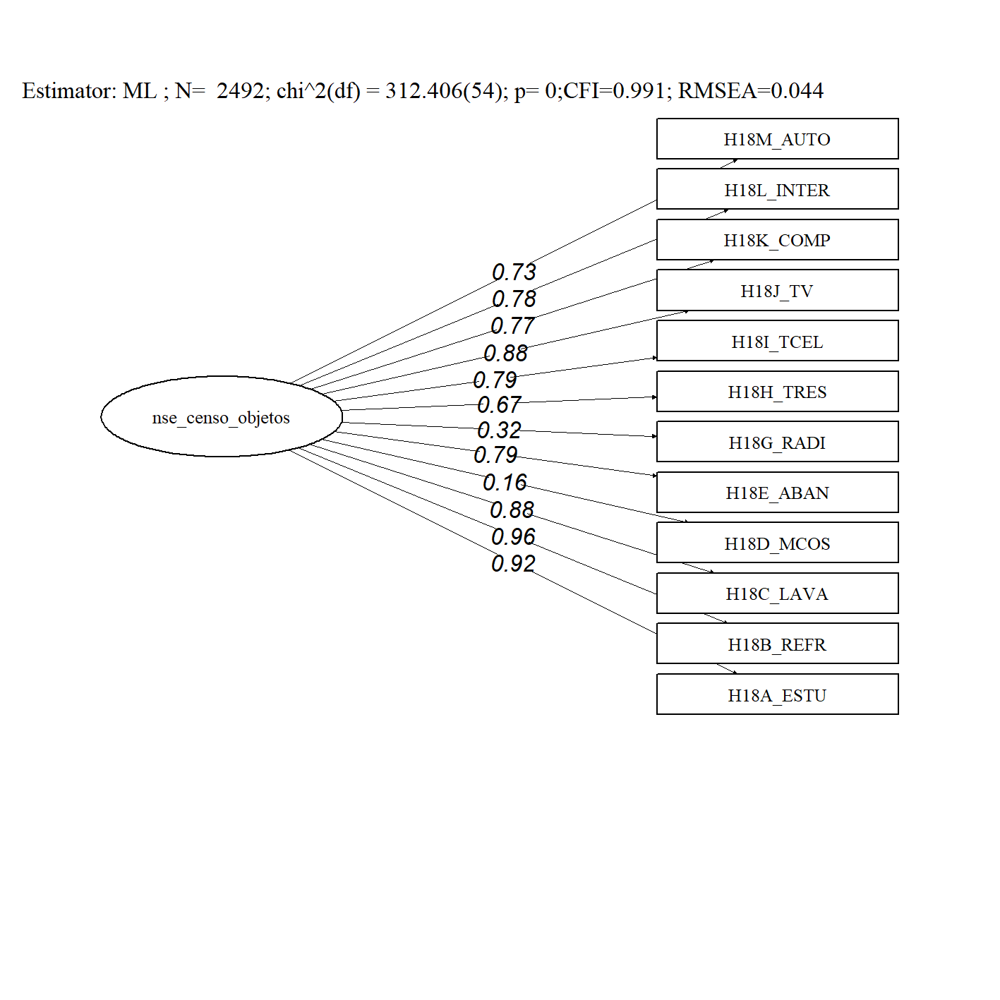

```{r setup, include=FALSE}
knitr::opts_chunk$set(echo = TRUE,message=FALSE, warning = FALSE)
```

# Cargar y preparar datos 

```{r}
#Cargar funciones y paquetes 


if (!require("pacman")) install.packages("pacman")
pacman::p_load(dplyr, haven, psych)

```

Si necesitas agregar alguna variable al analisis debes hacerlo en esta parte

```{r}
library(readr)
CEN2023_HOGAR<- read_csv("input/CEN2023_PANAMA.csv")

CEN2023_HOGAR = CEN2023_HOGAR %>% dplyr::select(id_hogar,
                         starts_with("H18"))

```


# Descripción de variables

```{r}
library(dplyr)
library(tidyr)

CEN2023_HOGAR %>% 
  summarise(across(everything(), ~mean(.x, na.rm = TRUE))) %>% 
  tidyr::pivot_longer(
    cols = everything(),
    names_to = "variable",
    values_to = "media"
  ) %>% kableExtra::kbl() %>% 
        kableExtra::kable_styling()
```


# Analisis de fiabilidad

Correlación entre variables


```{r}
CEN2023_HOGAR %>% dplyr::select(starts_with("H18")) %>% na.omit() %>% cor() %>% corrplot::corrplot(method = "number")
```

 * se ven grupos de correlaciones, probablemente exista más de una dimensión


```{r}
CEN2023_HOGAR %>% 
  dplyr::select(contains("H18")) %>% 
  psych::alpha() %>% 
  (\(x) x$total$raw_alpha)()
```
*  alpha de 0.8, bastante bueno, probablemente se puedan usar todas las variables como una dimension. 

# Analisis de validez de constructo


```{r}
library(lavaan)

modelo_factorial  = '

nse_censo_objetos =~ H18A_ESTU  + H18B_REFR  + H18C_LAVA  + H18D_MCOS  + H18E_ABAN +
                     H18G_RADI + H18H_TRES + H18I_TCEL + H18J_TV + H18K_COMP + H18L_INTER + H18M_AUTO 

'

fit_cfa = cfa(model= modelo_factorial, ordered = T, data = CEN2023_HOGAR)

# 
# summary(fit_cfa,
#         standardized = TRUE, # mostrar cargas estandarizadas
#         fit.measures = TRUE) # mostrar índices de ajuste extendidos
```
*  El modelo tiene un ajuste bastante decente, pero cargas factoriales deficientes para algunos items. Eliminemoslos


```{r include=FALSE}

library(cowplot)
library(ggplot2)
library(draw)

mod_conf_cfa=fit_cfa


library(sjPlot)
library(dplyr)
library(lavaan)
library(semPlot)
library(corrplot)
library(psych)
library(knitr)
library(kableExtra)
library(rvest)
library(sjlabelled)

fm03<- data.frame(v1=fitmeasures(mod_conf_cfa, output ="matrix")[c("chisq","df","cfi","rmsea","pvalue"),])
fm03 <- round(fm03,3)
par(mai = c(2,2,2,2)) # Set the margin on all sides to 2
par(mar = c(5, 5, 5, 5)) # Set the margin on all sides to 6
layout(matrix(c(1, # semPlot
                1, # semPlot
                1,
                1,
                1,
                2),# ajuste
              nrow=6,
              byrow=TRUE))


# Crear el diagrama semPath
Plot_sem <- semPaths(
 # include = 1,
  #panelGroups  = T,
  combineGroups = F,
  mod_conf_cfa,           # Modelo de análisis factorial confirmatorio a visualizar
  whatLabels = "std",     # Etiquetas de valores estandarizados
  label.cex = 0.8,        # Tamaño de las etiquetas dentro de los nodos
  edge.label.cex = 1.2,   # Tamaño de los valores estimados en las flechas
  residuals = F,       # Mostrar residuos
  optimizeLatRes = FALSE, # Optimizar los residuos de factores latentes
  edge.color = "black",   # Color de las flechas
  style = "lisrel",       # Estilo del diagrama (por ejemplo, LISREL)
  nCharNodes = 0,         # Número de caracteres en los nodos (0 para auto)
  curvePivot = FALSE,     # Curvar las flechas de acuerdo a las cargas
  curve = 6,            # Curvatura de las flechas (ajustable)
  rotation = 2,           # Rotación del diagrama
  #layout = "tree",       # Diseño del diagrama
  cardinal = "lat cov",   # Información sobre cardinalidad y covarianzas
  legend.cex = 0.6,       # Tamaño de la leyenda
  label.cex = 1.3,        # Tamaño de etiquetas
  label.font = 6,         # Fuente de etiquetas
  edge.label.font = 3,   # Fuente de etiquetas en las flechas
  asize = 3,              # Tamaño de las flechas
  edge.width = 0.3,       # Ancho de las flechas
  sizeMan = 6,            # Tamaño de las cajas de variables observadas (largo)
  sizeMan2 = 1,           # Tamaño de las cajas de variables observadas (alto)
  sizeLat = 6,          # Tamaño de los elipses de factores latentes (largo)
  sizeLat2 = 2,          # Tamaño de los elipses de factores latentes (alto)
  residScale = 1,        # Escala de los residuos
  width = 3,           # Ancho del diagrama
  height = 2.5,            # Alto del diagrama
  intercepts = FALSE,     # Mostrar interceptos
  reorder = F,         # Reorganizar los nodos
  thresholds = FALSE,     # Mostrar umbrales
  fixedStyle = 1,         # Estilo fijo
  node.height = 5,        # Altura de los nodos (ajustable para aumentar la separación vertical)
  node.width = 7,         # Ancho de los nodos
  label.scale = F,    # Escala de etiquetas
  shapeMan = "rectangle", # Forma de las cajas de variables observadas
  shapeLat = "ellipse",   # Forma de los elipses de factores latentes
  details = TRUE,          # Mostrar detalles en el diagrama
  )

ld <- standardizedsolution(mod_conf_cfa) |>  
    dplyr::select(lhs,op,rhs,est.std) |> 
    dplyr::filter(op=="=~") 

ld$est.std<- sprintf("%.2f", ld$est.std)

#install.packages("draw")
library(draw) #para hacer rectangulo de fit


drawText(x = 2, y = 4.3, text = paste0("Estimator: ML ", "; N=  ",nobs(mod_conf_cfa), "; chi^2(df) = ",fm03[1,],"(",fm03[2,],")","; p= ",fm03[5,],";","CFI=",fm03[3,],"; RMSEA=",fm03[4,]),family = "serif",size = 8 )


#drawExport("ajuste_ive.png",units = "cm",width = 18,height = 15,ppi = 300) 

drawExport("output/ajuste_nse_objetos.png",units = "cm",width =12,height = 12,ppi = 300) 

```



* radio y mcos tienen baja carga factorial, los eliminamos y reajustamos el modelo

tipo de casa:

 

# Analisis IRT

```{r}
#install.packages("ltm")
library(ltm)
```


```{r}
modelo_irt <- ltm(CEN2023_HOGAR %>% dplyr::select(starts_with("H18")) ~ z1, IRT.param = TRUE)

# Mostrar el resumen del modelo
parametros = coef(modelo_irt) 

dificultad <- parametros[, "Dffclt"]   # b
discriminacion <- parametros[, "Dscrmn"]  # a

###

tabla_items <- as.data.frame(parametros) %>%
  tibble::rownames_to_column("item") %>%
  rename(
    dificultad = Dffclt,
    discriminacion = Dscrmn
  ) %>%
  dplyr::mutate(id = dplyr::row_number())

tabla_items %>% kableExtra::kbl() %>% kableExtra::kable_styling()
```


```{r}

# Graficar las curvas características del ítem (Item Characteristic Curves, ICC)
plot(modelo_irt, type = "ICC")
```
```{r}
plot(modelo_irt, type = "ICC", items = c(1,4,7))
```


```{r}

# Graficar las curvas de información del ítem (Item Information Curves, IIC)
plot(modelo_irt, type = "IIC")
```


```{r}
# Graficar la curva de información del test (Test Information Curve, TIC)
plot(modelo_irt, type = "IIC", items = 0)
```


# Ajustar un modelo reformado

```{r}
modelo_irt <- ltm(CEN2023_HOGAR %>% dplyr::select(starts_with("H18")) %>% dplyr::select(-H18G_RADI,-H18D_MCOS) ~ z1, IRT.param = TRUE)
```

# Creación de variable con AFC

 Provemos con analisis factorial.
```{r}
CEN2023_HOGAR_naomit = CEN2023_HOGAR %>% dplyr::select(starts_with("H18")) %>% dplyr::select(-contains("COMP"), -contains("RADI")) %>% na.omit()


CEN2023_HOGAR_naomit_llave = CEN2023_HOGAR %>% dplyr::select(id_hogar,starts_with("H18")) %>% dplyr::select(-contains("MCO"), -contains("RADIO")) %>% na.omit() %>% dplyr::select(id_hogar)


modelo_factorial  = '

nse_censo_objetos =~ H18A_ESTU  + H18B_REFR  + H18C_LAVA  + H18D_MCOS  + H18E_ABAN +
                     H18H_TRES + H18I_TCEL + H18J_TV  + H18L_INTER + H18M_AUTO

'

```


# Creación de variable con IRT
 
```{r}
scores <- factor.scores(modelo_irt, method = "EB")
puntuaciones_latentes <- scores$score.dat

sum(puntuaciones_latentes$Obs)


puntuaciones_latentes <- puntuaciones_latentes %>%
  tidyr::unite("H_collapsed", starts_with("H18"), sep = "", remove = TRUE)


CEN2023_HOGAR_idtest <- CEN2023_HOGAR %>% dplyr::select(-H18D_MCOS,-H18G_RADI) %>%
  tidyr::unite("H_collapsed", starts_with("H18"), sep = "", remove = TRUE)


CEN2023_HOGAR_idtest = left_join(CEN2023_HOGAR_idtest , puntuaciones_latentes, by="H_collapsed") %>% rename(nse = z1, se_nse = se.z1)


CEN2023_HOGAR_nse = left_join(CEN2023_HOGAR, CEN2023_HOGAR_idtest %>% dplyr::select(id_hogar, nse, se_nse),by="id_hogar") 
```


# Guardar datos  

```{r}
write.csv(CEN2023_HOGAR_nse, file="output/CEN2023_HOGAR_nse.csv")
```

