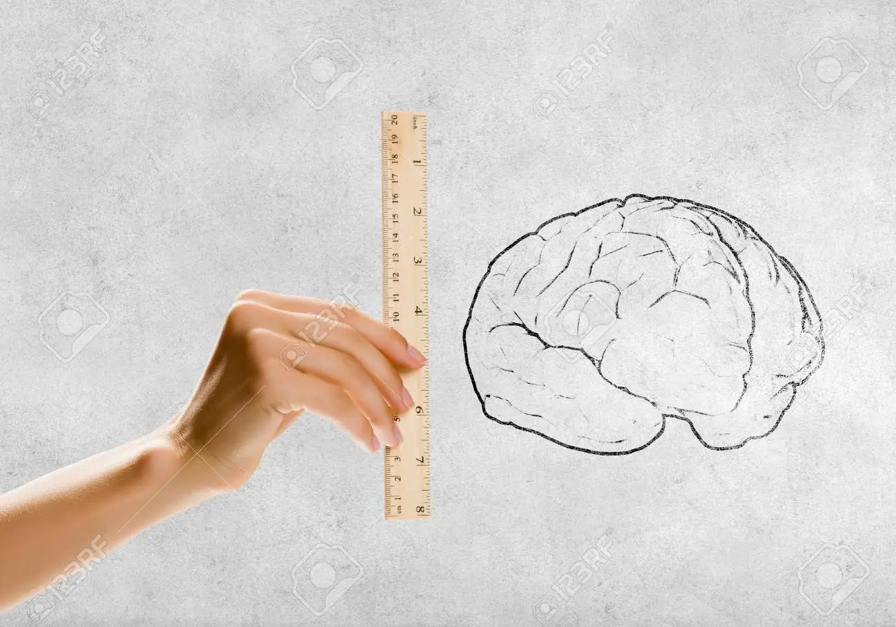
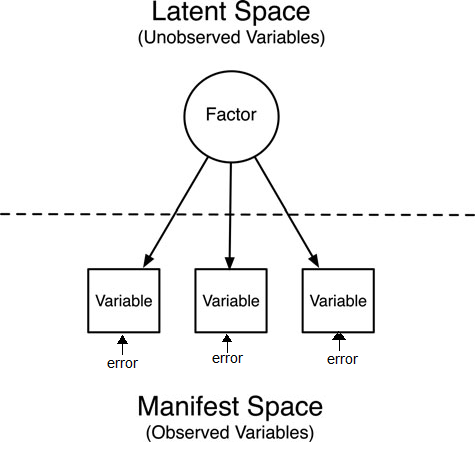
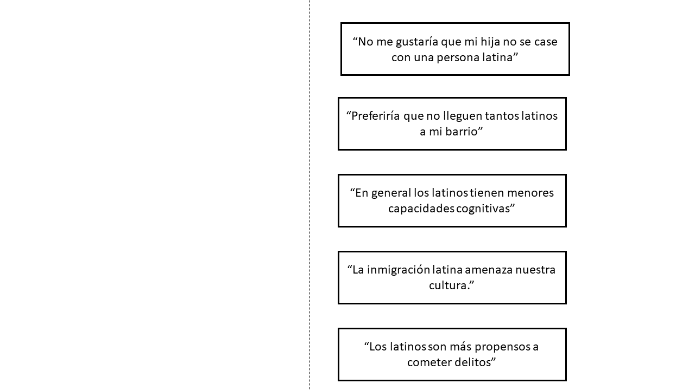
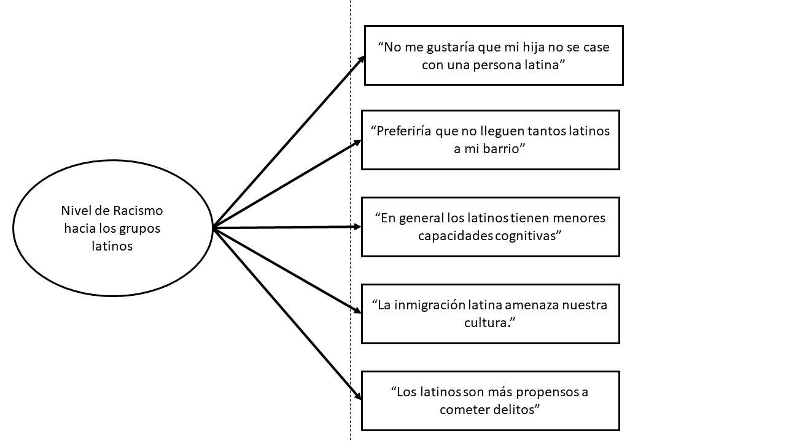
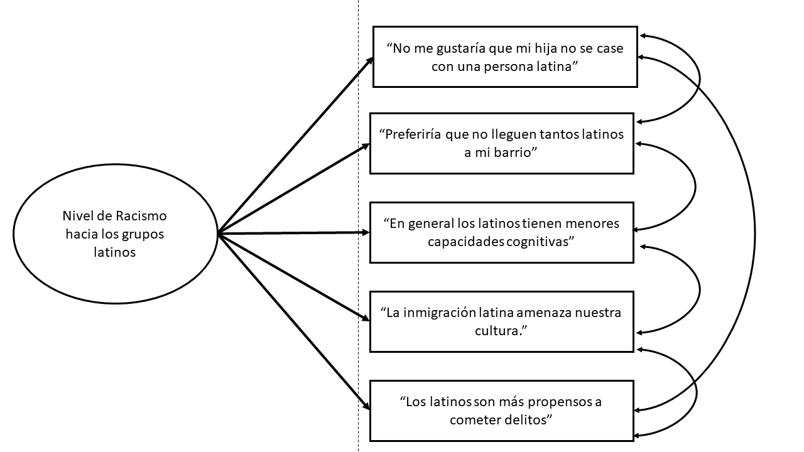
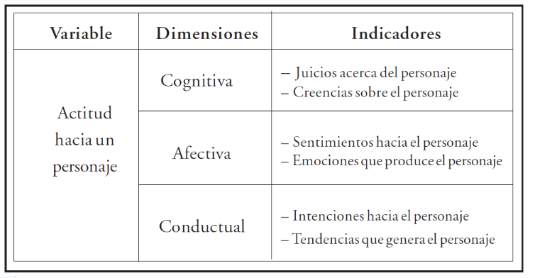
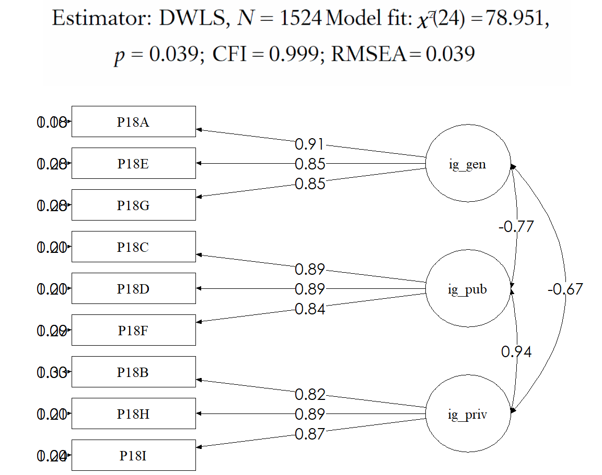
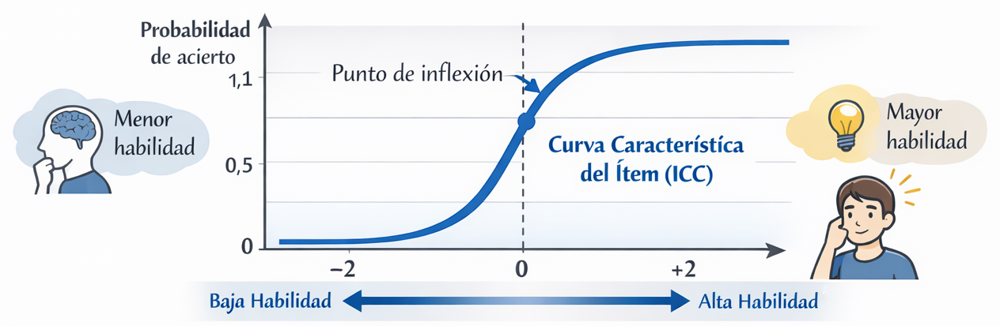
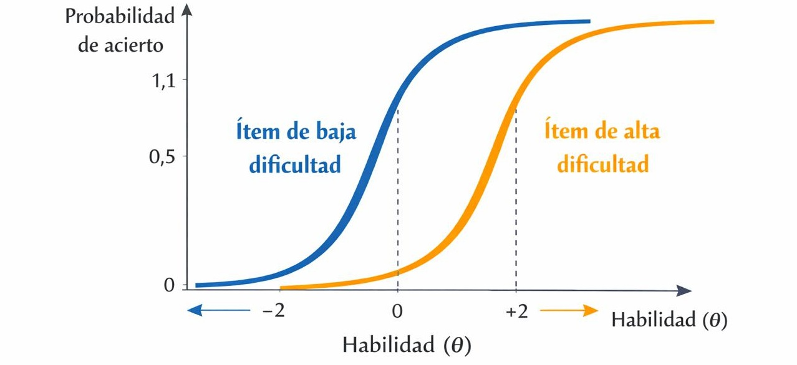
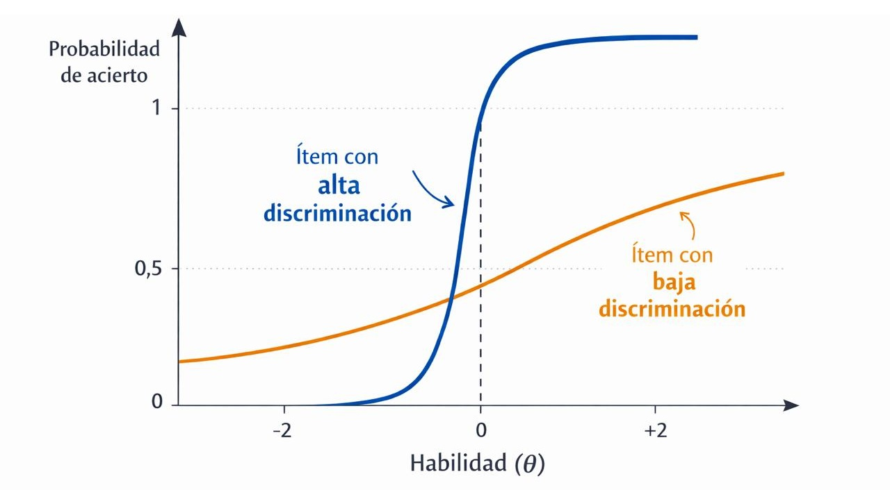

class: inverse, bottom, right

```{r, include=FALSE,echo=FALSE,results='hide'}
#install.packages("pagedown")
#pagedown::chrome_print("Presentacion_segregacion.html",output="Presentacion_segregacion.pdf")
```


```{r setup, include=FALSE, cache = FALSE}

library(dplyr)
require("knitr")
options(htmltools.dir.version = FALSE)
pacman::p_load(RefManageR)
 
```

```{r eval=FALSE, echo=FALSE}
# Correr esta línea para ejecutar
rmarkdown::render('xaringan::moon_reader')
```

<!---
About macros.js: permite escalar las imágenes como [:scale 50%](path to image), hay si que grabar ese archivo js en el directorio.
.pull-left[<images/Conocimiento cívico.png>] 
.pull-right[<images/Conocimiento cívico_graf.png>]

--->

# __Validación Psicométrica de Instrumentos__
## *Aproxiación teórica-practica al análisis factorial (CFA) y la teoría de respuesta al ítem (IRT)*
<br>
<hr>
## Taller interno IE-CIAE

### Francisco Meneses Rivas  - Asistente de Investigación

<br>

---


# Cronograma de la sesión


 ## Análisis factorial
 
  1. Conceptos centrales de la psicometría y el AFC  __[16:05 - 16:25]__

  2. Aplicación practica en R mediante ejercicio didactico __[16:26 - 17:05]__

## Teória de Respuesta al ítem 
  
  3. Aproximación teórica a la difucultad y discriminación del ítem. __[17:15 - 17:25]__
  
  4. Revisión conjunta de ejemplo aplicado en R. __[17:26 - 17:50]__
  

> Proceso metacognitivo: Ticket de salida

---
class: inverse, middle, center, slideInRight

# ¿Como medimos en Ciencias Sociales? 
## Asignar numeros a la realidad social


---

# El problema de la medición en ciencias sociales

- Variables observables y no observables directamente

- Ejemplos de variables "no observables" en ciencias sociales 

- Las variables latentes: medición indirecta

.center[

]

---

# Constructos y variables latentes

.pull-left[
 
 * __Perspectiva representacional__: 
    + Representar relaciones empiricas mediante numeros. 
    + Mayor ansiedad = Mayor valor numerico
* __Constructos__:
    - Aspectos no observables de la realidad
    - Sabemos que existen por sus consecuencias (Depresión)
* __Variables latentes__: 
    - Modelamiento estádistico de constructos
    
]
  
.pull-right[



]  
  
  
???

- Se basa en la inferencia del valor del constructo en base a variables observables

---

## Breve ejercicio



---

## Breve ejercicio



---

## Breve ejercicio




---

# ¿Tenemos una buena medición? 

La psicometría nos entrega los siguientes conceptos para profundizar en la calidad de nuestra medición. 

  * __Fiabilidad__
  
  * __Validez__ 
  
  * __Dificultad__ y  __Discriminación__ de los ítems
  
  * Sesgos y comparabilidad (No lo veremos)
  
> Profundicemos brevemente en cada uno de ellos 

---

# Fiabilidad

.pull-left[
_¿Mi medición posee valores consistentes que representan prescisamente el nivel que se posee del constructo?_ 

Evidencias de fiabilidad: 
  * Medición repetida
  * Consistencia item-rtest 

Tecnica a utilizar: 

  * Alpha de crombach
  * Omega 

]

.pull-right[

> Ejemplo de problema de fiabilidad

* Incosistencia temporal 

* Incosistencia entre ítems

]


---


# Validez

.pull-left[
_¿Mi medición refleja el constructo que deseo medir y no otro/s?_ 


Tipos de evidencia de validez 
  * __Validez de constructo__:
      + Validación convergente
      + Validación de expertos
      + Encuestas cognitivas
  * __Validez interna del modelo__
      + Dimensionalidad correcta

Tecnica estadística a utilizar: 
  * Análisis factorial

]

.pull-right[

> Ejemplos de problemas de validez

* Incorporar otros conocimientos/ideas en ítems fuera de lo que se desea medir (erroe de medida / sesgos)

* Las dimensiones de mi operacionalización no se corresponden con las asociaciones entre los datos.


]

---

## Ejemplo de problema de validez 1:  Sesgo cultural del ítem

* ítem de inteligencia en reclutamiento de soldados (1917), dimensión sentido comun. 

__Por favor, dibuje lo que falta en la imagen__

.pull-left[

]

--

.pull-right[

> Muchos de los evaluados nunca habían visto un partido de ténis. Por lo que esto no medía su sentido comun ni inteligencia, sino su conocimiento de un deporte en particular. 

]


---
## Ejemplo de problema de validez 2: Dimensionalidad incorrecta


.center[

]

* Este modelo de medición asume que "_juicios_" y "_creencias_" se asocian más entre si (Por que son causados por la dimension latente "cognitiva")

* Si "_juicio_" se asocia más con "_emociones_" que con "_creencias_" los datos no se ajustan al modelo


---


## Modelos de medición y factores
.pull-left[
Operacionalizacion de los constructos

  + Teoría
  + Dimensiones
  + Itéms
  + Preguntas
  
  ]

.pull-right[
Evaluamos estadisticamente la calidad de la escala

  + Fiabilidad -  alpha de crombach
  + Validez interna - Análisis factorial
  ]
  
.center[  

]
---


# Analisis factorial: Conceptos elementales

.pull-left[

> _¿Cuantas y cuales son las dimensiones poseen nuesto conjunto de variables?_

  __Conceptos centrales__

- Factores

- Cargas factoriales

- Comunalidad

- Varianza unica - Error de medición  


]

.pull-right[


]


???

- __Factores__: Los factores se producen cuando existe covarianza entre los indicadortes. se presume que esta correlacion entre los indicadores se debe a que son causadas por la misma variable latante. (por ejemplo capacidad de multuplicar)

- __Cargas factoriales__:  cuanto explica la variable latente al indicador

- __Comunalidad__: conjunto de covarianza entre los indicadores

_ __Error de medida__: el error de medición es la varianza que no es explicada por el factor comun. se interpreta como varianza del indicador que se debe a otra cosa (ejemplo prueba de mate con footbol.) (ejemplo medición de machismo. - gritar)

---

# Indicadores de ajuste 

> Son pruebas estádisticas que reflejan cuan bien se ajusta el modelo teórico a nuestro nuestros datos.

.small[

| Índice de ajuste | Nombre completo | Qué evalúa | Buen ajuste | Ajuste aceptable |
|------------------|-----------------|------------|-------------|------------------|
| χ² (Chi-cuadrado) | Chi-square test | Diferencia entre la matriz de covarianzas observada y la estimada | p > 0.05 | Sensible al tamaño muestral |
| χ² / df | Chi-square / grados de libertad | Ajuste relativo controlando complejidad del modelo | < 2 | < 3 o < 5 |
| CFI | Comparative Fit Index | Mejora del modelo respecto a un modelo nulo | ≥ 0.95 | ≥ 0.90 |
| RMSEA | Root Mean Square Error of Approximation | Error de aproximación poblacional del modelo | ≤ 0.05 | ≤ 0.08 |
| BIC | Bayesian Information Criterion | Comparación entre modelos penalizando complejidad | Menor valor | Menor valor |

]
---



---

# Del diagrama al modelo en R 


.pull-left[


]


.pull-right[

```{r eval=FALSE, include=TRUE}
modelo = '

L1 =~ i1 + i2 + i3

L2 =~ i4 + i5 + i6
'
```


Así pasamos del diagrama al modelo en $lavaan$
  
  * una ecuación por latente
  * __=~__ significa medido por

]

---
class: inverse, middle, center, slideInRight

#  ¡Vamos al R! 

## ... pero antes ...

---

# Instrucciones: 

  1. Accede al documento de google sheets "Pre-registros y resultados" . 
  
  2. Ordena en conjunto con alguien los siguientes indicadores y propone un modelo.

  3. Prueben la valides de su modelo mediante el codigo en R
  
  4. Registren los resultados.
  
---

# Indicadores

| Código variable | Pregunta |
|-----------------|----------|
| m8_p88_1 | ¿Controla tus salidas, horarios o apariencia? |
| m8_p88_2 | ¿Alguna vez te pegó, empujó, zamarreó? |
| m8_p88_3 | ¿Descalifica lo que dices, haces o sientes? |
| m8_p88_4 | ¿Trata de alejarte de tus amigas y amigos? |
| m8_p88_5 | ¿Controla tus gastos y del dinero que dispones? |
| m8_p88_6 | ¿Revisa tu celular, tu correo o tus redes sociales sin tu consentimiento? |
| m8_p88_7 | ¿Te presiona para tener relaciones sexuales? |
  
---
class: inverse, middle, center, slideInRight

#  Teoría de respuesta al ítem

##  Dificultad y discriminación de los ítem

---


# Teoría de Respuesta al Ítem (TRI)

Una perspectiva moderna de medición psicométrica.

Se centra en **modelar probabilísticamente la relación entre:**

- las **características de los ítems**
- y las **habilidades latentes de las personas**

En lugar de analizar solo **puntajes totales**, modela el **comportamiento de cada ítem**.

---

# Principios

La TRI se basa en un principio simple:

> **La probabilidad de responder correctamente un ítem depende de la habilidad de la persona y de las propiedades del ítem.**

Formalmente:

- cada persona tiene una **habilidad latente** (θ)
- cada ítem tiene **parámetros psicométricos**

A partir de esto se puede **predecir probabilísticamente la respuesta a un ítem**.

---

# Qué nos informa la TRI

Modelar los ítems permite estimar:

- **Dificultad del ítem**  
- **Capacidad de discriminación**
- (en algunos modelos) **probabilidad de acierto por azar**

Esto permite entender:

- qué tan difícil es un ítem
- qué tan bien distingue entre personas con distinta habilidad
- en qué niveles de habilidad el ítem es más informativo

---

# Modelo conceptual

La TRI describe la relación entre:


.small[
**Probabilidad de responder correctamente un ítem** <- **Habilidad latente de un individuo (θ)**
]


**Curva Característica del Ítem (ICC)**:  La ICC muestra cómo cambia la probabilidad de acierto a medida que aumenta la habilidad.



---

### Dificultad (parámetro b)

La **dificultad** indica el nivel de habilidad necesario para tener una probabilidad moderada de responder correctamente un ítem.

.pull-left[ítems **más difíciles** personas con mayor habilidad pueden responderlos correctamente]

.pull-right[ítems **más fáciles** personas con menor habilidad pueden responderlos correctamente]

> 




---

# Interpretación de la dificultad de un ítem

.pull-left[
- **b = 0**     → dificultad promedio
- **b > 0**  → ítem más difícil
- **b < 0 **  → ítem más fácil
]

.pull-right[
>La dificultad indica **en qué nivel de habilidad el ítem resulta más informativo**.
]


---

# Capacidad de discriminación $a$

La **discriminación** indica qué tan bien un ítem distingue entre personas con distinta habilidad.

En la curva característica: La discriminación se observa como **la pendiente de la curva**.


---

## Interpretación de la discriminación

.pull-left[**Alta discriminación** ($a$>1)
  - curva más empinada
  - el ítem distingue bien entre distintos niveles de habilidad]

.pull-right[**Baja discriminación** ($a$<0.5)
  - curva más plana
  - el ítem aporta poca información para diferenciar individuos]


---


# Idea clave

En la TRI:

> **Las respuestas observadas son manifestaciones probabilísticas de una habilidad latente.**

El objetivo del modelo es **inferir esa habilidad latente a partir del patrón de respuestas a los ítems.**


---
# Ventajas de la TRI

Comparada con la Teoría Clásica de los Test, la TRI permite:

- analizar **cada ítem individualmente**
- estimar **habilidad independiente del test específico**
- construir **tests adaptativos**
- estudiar **funcionamiento diferencial de ítems**

Por esto es ampliamente utilizada en:

- evaluaciones estandarizadas
- tests adaptativos
- medición educativa a gran escala

---

# Resumen de valores de referencia

| Parámetro | Tipo | Valor de referencia | Nivel |
|---|---|---|---|
| a | Discriminación | 0.5 | Baja |
| a | Discriminación | 1.0 | Moderada |
| a | Discriminación | 2.0 | Alta |
| b | Dificultad | -1 | Fácil |
| b | Dificultad | 0 | Media |
| b | Dificultad | 1 | Difícil |


---

class: inverse, middle, center, slideInRight

#  IRT

##  Ejmplo aplicado


---


class: inverse, bottom, right


# __Validación Psicométrica de Instrumentos__
## *Aproxiación teórica-practica al análisis factorial (CFA) y la teoría de respuesta al ítem (IRT)*
<br>
<hr>
## Taller interno IE-CIAE

### Francisco Meneses Rivas  - Asistente de Investigación

<br>


